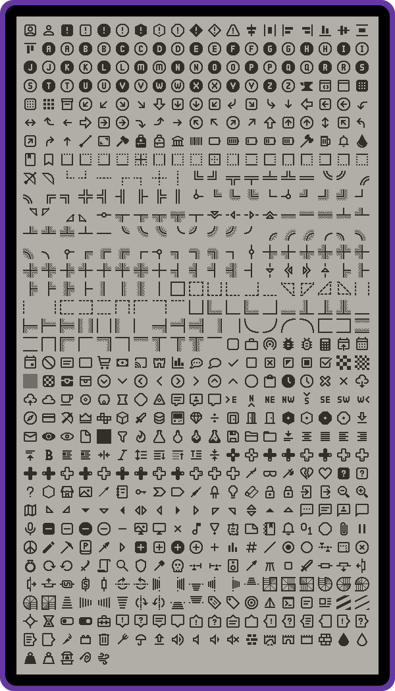

# Memory Icons

The Memory icon set contains 22x22 pixelated icons. Ideal for the Sharp Memory 2.7" Display.

## Usage

### Moddable SDK

[View usage instructions for Moddable SDK](moddable)

### Playdate

[View the usage instructions for Playdate devs](playdate)

## Contributions

Create an issue instead of a Pull Request.

### Request an Icon

1. Create an issue requesting the icon.
1. Include examples of the icon.

### Contribute an Icon

1. Create an issue with the name of the icon.
1. Attach an image of the icon.

## Development

- `npm run preview` - Generates `assets/preview.svg`
- `npm run playdate` - Generates Playdate files.