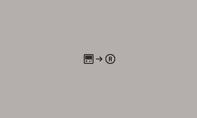

# Playdate Instructions

The Playdate console uses the Sharp Memory 2.7" display.

- [memory-table-22-22.png](./memory-table-22-22.png) - Sprite map of all icons
- See Lua or C mappings with example code.



> **Why would I include the entire sprite map if I only need a few icons?**
>
> Ease of developer use. The sprite map is small due to the monochrome color pallet. Each icon is read off flash storage as neccessary using little resources.

## Lua

Copy the two files in this folder to your project.

- `icon.lua` to `source/icon.lua`
- `memory-table-22-22.png` to `source/images/memory-table-22-22.png`

```lua
import "CoreLibs/object"
import "CoreLibs/graphics"
import "CoreLibs/sprites"

import "icon"

local pd <const> = playdate
local gfx <const> = pd.graphics

local icon3 = Icon(224, 120, IconAlphaA)

local function initialize()
    gfx.setColor(gfx.kColorBlack)
    local icon1 = Icon(180, 120, IconDevice)
    icon1:add()
    local icon2 = Icon(202, 120, IconArrowRight)
    icon2:add()
    icon3:add()
end

initialize()

function playdate.update()
    gfx.sprite.update()
    if playdate.buttonIsPressed(playdate.kButtonA) then
        local i = math.random(1, 200)
        icon3:setIcon(i)
        print('Random', i)
    end
end
```

## C

I don't know C... so let me know what to generate.